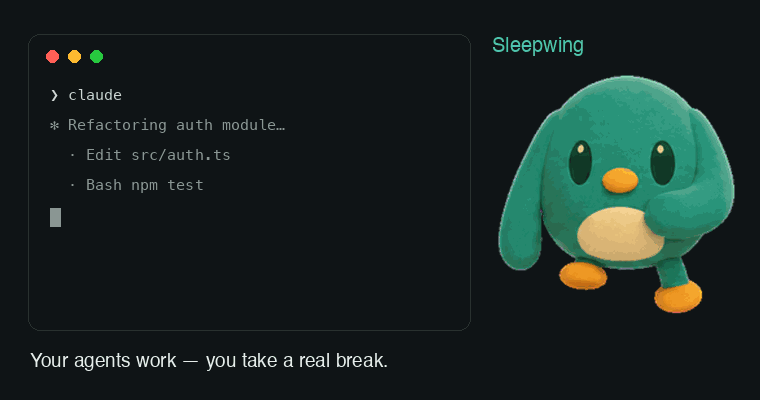

# Sleepwing

> 曾用开发代号 Perch；源码内部模块名保留该代号。

中文 | [English](README.md)

Sleepwing 是一款隐私优先的 macOS 桌面陪伴应用，在本地 AI 编程 Agent 工作时守着它，让你能真正休息一下。它把已验证的 Agent 工作时间转换为有边界的健康机会，并在 Agent 需要你输入时把你叫回来。一只桌宠代表所有已连接的 Agent；精确状态、集成管理和本地统计都在菜单栏里处理。

> AI 干活，你歇会儿——需要你的时候，它会把你叫回来。

<p align="center">
  <a href="https://github.com/lttxzmj/sleepwing/actions/workflows/ci.yml"></a>
  
  
  
  
</p>

<p align="center">
  
</p>

<p align="center">
  <a href="https://github.com/lttxzmj/sleepwing/releases/latest"><b>⬇ 下载已公证的 Beta</b></a> · 免费 · macOS 14+ · Apple Silicon · 零对外网络
</p>
或使用 Homebrew 安装：

```sh
brew install --cask lttxzmj/tap/sleepwing
```

> 正式构建实测（Apple Silicon，空闲 40 秒采样）：**CPU ≈0.8%，内存 ≈100 MB**（桌宠 30fps 待机）。资源上限由测试钉死。


官方安装包仅通过 [GitHub Releases](https://github.com/lttxzmj/sleepwing/releases) 发布；唯一官方网站是 [lttxzmj.github.io/sleepwing](https://lttxzmj.github.io/sleepwing/)。

## 当前状态

本仓库包含 v0.6.0 Beta RC 开发构建：

- 一只透明、可拖动的桌宠，由所有已连接的 Agent 共用
- 两只内置角色，具备可控的性格设定、随角色自适应的强调色、三档尺寸、悬浮/桌面两种层级、按显示器记忆位置，并支持"减少动态效果"
- 原生的登录时启动控制，带 macOS 授权状态引导
- 独立的休息、工作、需要关注、庆祝和健康提醒展示状态
- 基于「平台 + 不透明会话生命周期」构建的隐私安全任务收件箱，包含单任务运行时长、关注状态、返回操作和生命周期范围内的静音
- 菜单栏和桌宠气泡使用同一套任务语义，而不是把每个会话都压扁成一条通用的 Agent 消息
- 按真实时钟计算的健康机会计时，并行工作只计一次，遇到需要关注的状态会暂停
- 传输到本地前先由原生中继层脱敏；只有平台、不透明会话 ID、阶段、时间戳、一个有长度上限的项目/任务标签，以及一条白名单校验过的本地返回路径会进入 App
- 终端会话精准返回：Hook 只捕获会话的控制终端设备名，点「打开任务」即可在 Terminal.app / iTerm2 中选中承载它的那个标签页（首次需要一次 macOS 自动化授权）；其他宿主保持 App 聚焦
- 目前支持 Claude Code、本地 Cursor、ChatGPT/Codex、OpenCode、Gemini CLI、TRAE、pi coding agent 的生命周期适配器，安装器可逆，卸载时只清理 Sleepwing 自己写入的部分
- Codex 回合边界防抖：Hook 收到 `Stop` 后如果任务继续，不会误判为已完成；只有确认的静默窗口或会话结束才算完成
- 带状态的菜单栏文案、引导流程、可操作的 macOS 通知、中英文双语、本地健康/工作统计，以及原子化持久化
- 面向行动的状态文案、App 焦点回归，以及"工作中"与"完成后"两种提醒策略
- 自动化的、内容无关的连接探测，与真实 Agent 活动明确区分
- 记录"最近一次真实生命周期事件"的时间，避免把"曾经验证过"和"现在活跃"混淆
- 通知健康状态能区分授权状态和横幅可见性，不会把诊断信息塞进主界面
- 一个统一的提醒投递协调器，让桌宠气泡、可见的系统横幅、免打扰时段、关注优先级和十分钟持久稍后提醒保持一致
- 一键生成、白名单校验的诊断报告，会在 Finder 中打开，且不可能包含提示词、代码、回答、工具输入、路径或标识符
- 可选的"已验证工作时保持系统唤醒"功能，会在整个活跃会话期间（工作中与等待输入都算）保持屏幕常亮，并在电源安全条件触发时自动释放
- 本地七天时间对比，覆盖"工作中"和"完成后"两种提醒策略，附带关注响应护栏
- 本地每日和七天完成任务计数，与健康产出分开统计
- 针对不同角色的连续性文案，会记住今天已完成的休息次数和已找回的时间，但不会把屏幕使用时间做成游戏化积分
- 一个 Agent 技能形式的 Pet Studio，安装内置的 `perch-pet` 工作流，导入经过校验的 `.perchpet` 素材包，并预览其真实的待机动作
- 自动发现安装在 `~/.codex/pets` 下的 Codex 格式宠物——例如来自社区画廊 [Petdex](https://petdex.dev)（`npx petdex install`）或 [codexpet.top](https://codexpet.top)——与 `.perchpet` 包一同显示在宠物工作室
- 随 App 提供、适用于不同 Agent 的 `perch-pet` 工作流和校验器；只有用户环境中确实存在可选的 `hatch-pet` Skill 时，Codex 才会把专业制作交给它
- 屏幕变化、Space 切换、解锁和唤醒时都能保持桌宠可见并正确恢复
- 有边界、感知版本变化的精灵图集缓存，带状态预热和贴合每个动画声明时长的帧调度
- 114 个确定性测试、一个临时签名的开发版 `.app`，以及一个失败即中止的 Developer ID/公证发布脚本

## 本地运行

开发环境要求：macOS 14+，Xcode 16+。

当前公开测试版的分发目标是 **macOS 14 或更高版本、Apple Silicon**。在完成同样的生命周期和干净设备验收流程之前，不承诺 Intel 兼容性。

```sh
swift test
swift run Sleepwing
```

打一个可双击运行、临时签名的开发版 App：

```sh
sh Scripts/build-app.sh
open .build/perch-app/Sleepwing.app
sh Scripts/smoke-event.sh claude PreToolUse
```

发送一条开发用事件：

```sh
printf '%s' '{"hook_event_name":"PreToolUse","session_id":"demo"}' \
  | sh Scripts/perch-hook claude
```

首次运行会引导用户完成角色选择、可选的 Agent 连接和实时状态预览。只有用户点击"安装"之后才会真正修改集成配置。

用户下载的 App 在运行时不依赖 npm、Node.js、Python 或开发者源码目录。Agent 监听、提醒、内置角色、连接配置和 `.perchpet` 导入校验均由原生代码和安装包内资源完成。只有让 Agent 制作新角色这一可选流程会使用该 Agent 宿主已有的工具；`hatch-pet` 只是增强能力，不是 App 依赖。

## 集成支持

| 平台 | Beta 支持情况 | 边界 |
|---|---|---|
| Claude Code | 本地生命周期 Hook | 仅限本地会话 |
| Cursor IDE / CLI | 本地 Agent Hook | 云端 Agent 不在范围内 |
| ChatGPT 桌面版 / Codex CLI / IDE | ChatGPT 产品内当前的 Codex 生命周期 Hook；旧版 `notify` 仅支持"完成"事件 | 首次安装可能需要信任 `/hooks`；普通对话不算生命周期任务 |
| OpenCode | 官方本地插件生命周期事件 | 已实现并有夹具测试；稳定会话的真机验证仍待补充 |
| Gemini CLI | 官方本地 Hook | 已在测试机上安装并通过中继层验证；真实任务的真机验证仍待补充 |
| TRAE IDE | 官方本地 Hook | 支持国际版和国内版两套配置路径；已有夹具测试，App 真机验证仍待补充 |
| pi coding agent | 官方本地扩展生命周期 | 已实现并有夹具测试；真实任务的真机验证仍待补充 |

延伸阅读：[自定义桌宠调研与流程](docs/CUSTOM_PET_RESEARCH_AND_FLOW.md)、
[产品策略](docs/PRODUCT_STRATEGY.md)、
[产品需求](docs/PRODUCT_REQUIREMENTS.md)、
[技术调研](docs/TECHNICAL_RESEARCH.md)、
[Hook 配置说明](docs/HOOK_SETUP.md)。

## 发布

本地跑一遍源码关卡：

```sh
sh Scripts/release-preflight.sh
```

公开测试版的构建流程刻意做成"失败即中止"。需要一张 Developer ID Application 证书和一个已认证的 `notarytool` Keychain Profile：

```sh
PERCH_SIGN_IDENTITY="Developer ID Application: …" \
PERCH_NOTARY_PROFILE="perch-notary" \
sh Scripts/build-beta.sh
```

该脚本会运行测试和源码检查，用 Hardened Runtime 和安全时间戳签名，把 ZIP 提交给 Apple，粘贴并校验公证票据，运行 Gatekeeper 评估，最终产出签名后的 ZIP 和带 SHA-256 校验值的 `release-manifest.json`。只有在
[公开测试版发布清单](docs/RELEASE_CHECKLIST.md)全部完成后才能正式发布。

另见[隐私政策](PRIVACY.zh-Hans.md)、[安全政策](SECURITY.md)、[更新日志](CHANGELOG.md)、[卸载指南](docs/UNINSTALL.md)。

## 许可

Sleepwing 采用[Functional Source License 1.1，MIT Future License](LICENSE.md)（FSL-1.1-MIT）以源代码可公开审计的方式发布：你可以阅读、审计、编译和修改代码用于任何非竞品性质的用途，每个版本发布满两年后自动转为 MIT 许可。品牌和美术素材单独授权 — 见 [LICENSE-ASSETS.md](LICENSE-ASSETS.md)。

## 隐私承诺

Sleepwing 只记录平台名称、不透明会话标识符、生命周期阶段、时间戳、提醒类型、提醒响应，以及有边界的时长指标。它不会持久化提示词、模型回答、代码、路径、工具参数或工具输出。

对于实时任务收件箱，Sleepwing 可能会在会话过期前，在内存中保留平台提供的任务标题、一个经确定性清洗、不超过 42 个字符的 Codex 请求标签，或 `cwd` 的最后一段（例如 `Sleepwing`，绝不是完整路径）。附件名、路径、类似 UUID 的标识符、标记语言包裹和格式错误的 Unicode 在进入本地传输前就会被拒绝。Sleepwing 永远不会持久化完整的提示词。Codex 的恢复链接是白名单校验过的 `codex://threads/<session-id>` 路由，不会被写入统计或诊断报告。

完整政策见 [PRIVACY.zh-Hans.md](PRIVACY.zh-Hans.md)（也有[英文版](PRIVACY.md)）。
